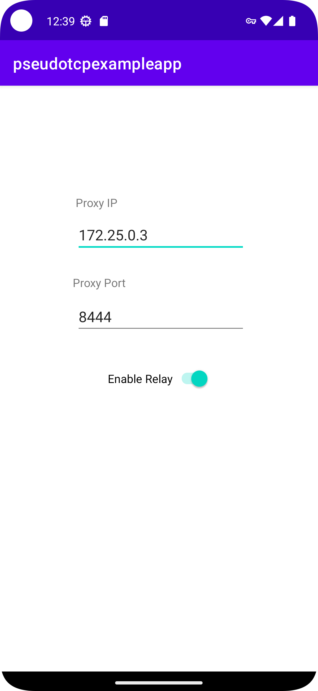

# 🔒 Pseudotcp Example App

[](https://github.com/invisv-privacy/pseudotcp-example-app/actions)
[](https://opensource.org/licenses/BSD-3-Clause)

An Android example application demonstrating the integration of [Invisv's pseudotcp library](https://github.com/invisv/pseudotcp) using [Android's VPN APIs](https://developer.android.com/develop/connectivity/vpn) and gomobile bindings.

## 🔍 Overview

This application demonstrates how to implement a VPN service in Android that routes traffic through a MASQUE proxy using the pseudotcp library. It showcases:

- Integration with Android's VPN Service API
- Go-to-Java bindings using gomobile
- Implementation of pseudotcp for reliable transport
- MASQUE client for proxy communication



## 🛠️ Prerequisites

- Android Studio (latest version recommended)
- Go 1.23 or later
- [gomobile](https://pkg.go.dev/golang.org/x/mobile/cmd/gomobile)
- Docker (for testing)
- Android SDK with API level 33 or higher

## 🏗️ Building

### Building the Go Code

The Go code is built with [gomobile](https://pkg.go.dev/golang.org/x/mobile/cmd/gomobile). Use the provided build script:

```bash
$ cd app/src/go
$ ./build.sh
```

This will generate an `.aar` file and move it to the appropriate Android libs directory.

> **Important**: After building the Go code, remember to sync your project with Gradle files in Android Studio to reload the newly built library.

### Building the Android App

Open the project in Android Studio and build the app using the standard build process:

```bash
$ ./gradlew assembleDebug
```

## 📱 Usage

1. Install the app on your Android device or emulator
2. Launch the app
3. Enter the proxy IP and port (defaults to 127.0.0.1:8444)
4. Toggle the switch to enable/disable the VPN service
5. The app will route all traffic through the specified MASQUE proxy

## 🧪 Testing

This repo includes a comprehensive end-to-end test that exercises the entire network stack.

### Testing Architecture

```
┌──────────────────────────────┐           ┌──────────────────────────────────┐
│                              │           │  Docker containers               │
│ Android Emulator (qemu)      │           │   ┌─────────────────────────┐    │
│                              │           │   │ Echo server             │    │
│  ┌───────────────────────┐   │           │   │                         │    │
│  │  PseudotcpExampleApp  │   │           │   │                         │    │
│  │                       │   │           │   │                         │    │
│  └─────────┬─────────────┘   │           │   │   172.25.0.4            │    │
│            │                 │           │   │                         │    │
│  ┌─────────▼─────────────┐   │           │   │                         │    │
│  │  gomobile bindings    │   │           │   │                         │    │
│  │                       │   │           │   └───────────▲─────────────┘    │
│  └─────────┬─────────────┘   │           │               │                  │
│            │                 │           │               │                  │
│  ┌─────────▼─────────────┐   │           │   ┌───────────┼─────────────┐    │
│  │     pseudotcp         │   │           │   │ h2o MASQUE Proxy        │    │
│  │                       │   │           │   │                         │    │
│  └─────────┬─────────────┘   │           │   │                         │    │
│            │                 │           │   │                         │    │
│  ┌─────────▼─────────────┐   │           │   │    172.25.0.3           │    │
│  │    masque client      │   │           │   │                         │    │
│  │                       ┼───┼───────────┼──►│                         │    │
│  └───────────────────────┘   │           │   └─────────────────────────┘    │
└──────────────────────────────┘           └──────────────────────────────────┘
```

The emulator uses qemu and a base android image to create a virtualized android device. We then use the [uiautomator](https://developer.android.com/training/testing/other-components/ui-automator) tool to perform actions on the device, replicating actual user usage.

We use docker to run an [h2o](https://github.com/h2o/h2o) MASQUE proxy and another very simple echo server. The echo server responds to HTTP requests with information about the HTTP request, including the request IP.

Inside the automated test we can then start, check our initial reported IP, enable our sample app service, check our reported IP, and assert that the new reported IP is that of the proxy, proving that packets from the android host device are now passing through the MASQUE proxy as expected.

### Setting Up the Test Environment

Start the dockerized h2o server and echo server:

```bash
$ docker-compose up -d
```

The [docker-compose file](./docker-compose.yml) creates a custom network with subnet `172.25.0.0/24`. If this conflicts with your network, update the addresses in both the docker-compose file and the [end2end test](./app/src/androidTest/java/com/invisv/pseudotcpexampleapp/End2EndTest.java).

### Running Tests

You can run tests through Android Studio or from the command line:

```bash
$ ./gradlew connectedAndroidTest
```

An HTML report will be generated at:
`app/build/reports/androidTests/connected/debug/com.invisv.pseudotcpexampleapp.End2EndTest.html`

### Viewing Test Logs

To capture logs during test execution:

```bash
$ adb logcat "System.out:D End2EndTest:D *:S" & LOGCAT_PID=$! ; \
  ./gradlew connectedAndroidTest ; \
  test_ret=$? ; \
  if [ -n "$LOGCAT_PID" ] ; then kill $LOGCAT_PID; fi; \
  exit $test_ret
```
